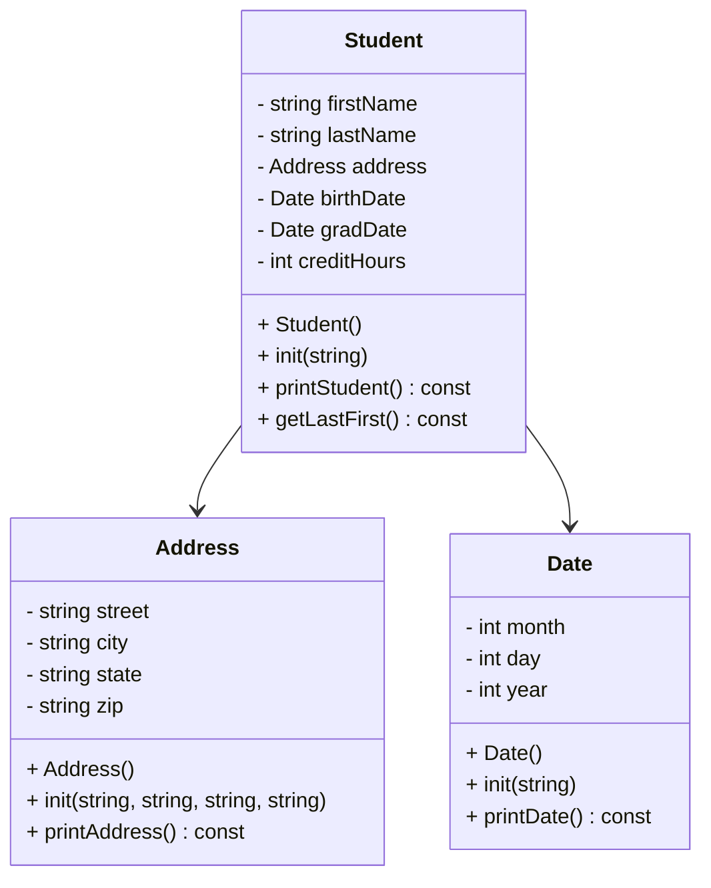

# CS121_Heap_of_Students
# UML Diagram



---

# Algorithms

## Address::init

```
function init(street, city, state, zip)
    assign street
    assign city
    assign state
    assign zip
end function
```

---

## Address::printAddress

```
function printAddress
    print street
    print city + " " + state + ", " + zip
end function
```

---

## Date::init

```
function init(dateString)

    create stringstream from dateString

    read characters until '/'
        convert to integer → month

    read characters until '/'
        convert to integer → day

    read remaining characters
        convert to integer → year

end function
```

---

## Date::printDate

```
function printDate

    create array of month names

    print monthNames[month]
    print day
    print year

end function
```

---

## Student::init

```
function init(csvLine)

    create stringstream from csvLine

    split string using ',' delimiter
    store values in array

    firstName = field[0]
    lastName  = field[1]

    street = field[2]
    city   = field[3]
    state  = field[4]
    zip    = field[5]

    birthDateString = field[6]
    gradDateString  = field[7]

    creditHours = convert field[8] to integer

    call address.init(street, city, state, zip)
    call birthDate.init(birthDateString)
    call gradDate.init(gradDateString)

end function
```

---

## Student::printStudent

```
function printStudent

    print firstName + " " + lastName

    call address.printAddress()

    print "DOB: "
    call birthDate.printDate()

    print "Grad: "
    call gradDate.printDate()

    print "Credits: " + creditHours

    print separator line

end function
```

---

## Student::getLastFirst

```
function getLastFirst
    return lastName + ", " + firstName
end function
```

---

# Implementation Status (Week 1)

Address class implemented and tested.  
Date class implemented and tested.  
Student class implemented and tested with sample data.  
Makefile created with required targets.  

---

# Makefile Targets

make → builds program  
make run → runs program  
make debug → builds with debugging symbols  
make clean → removes object files and executable  
make valgrind → runs program using valgrind  

---

# Files Included

- main.cpp  
- address.h  
- address.cpp  
- date.h  
- date.cpp  
- student.h  
- student.cpp  
- Makefile  
- README.md  