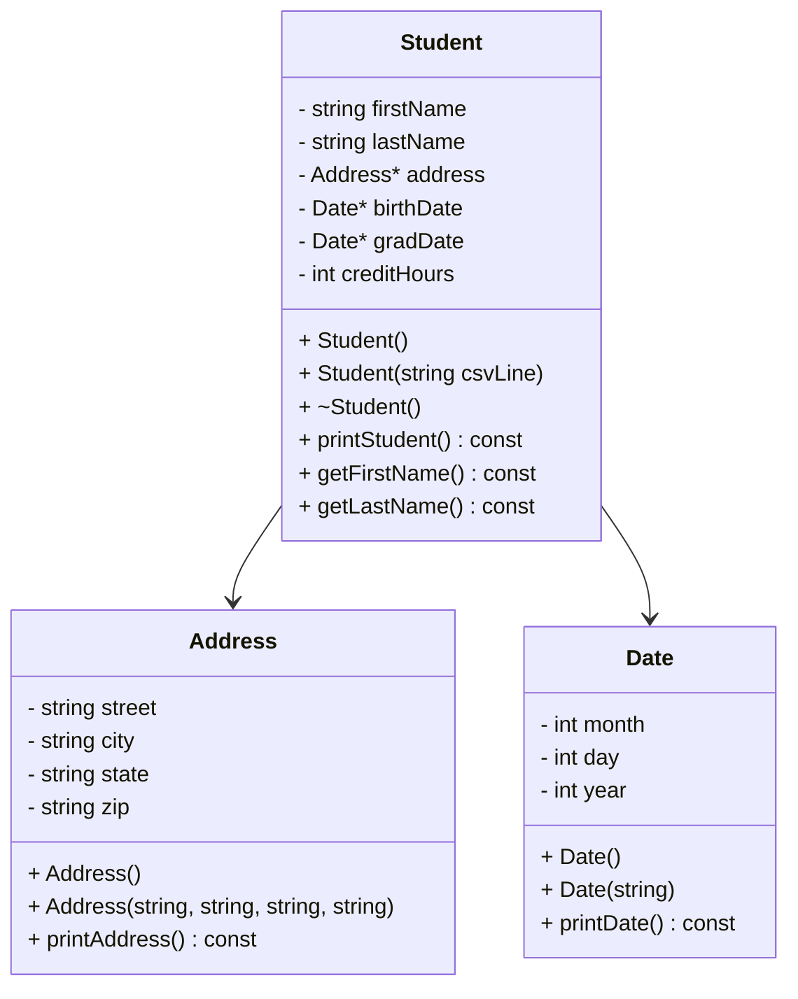

# CS121_Heap_of_Students
# UML Diagram



---

# Algorithms

## Address::init

```
function init(street, city, state, zip)
    assign street
    assign city
    assign state
    assign zip
end function
```

---

## Address::printAddress

```
function printAddress
    print street
    print city + " " + state + ", " + zip
end function
```

---

## Date::init

```
function init(dateString)

    create stringstream from dateString

    read characters until '/'
        convert to integer → month

    read characters until '/'
        convert to integer → day

    read remaining characters
        convert to integer → year

end function
```

---

## Date::printDate

```
function printDate

    create array of month names

    print monthNames[month]
    print day
    print year

end function
```

---

## Student::init

```
function init(csvLine)

   create stringstream from csvLine

    read lastName from stream
    read firstName from stream

    read street
    read city
    read state
    read zip

    read birthDateString
    read gradDateString

    read creditHours

    create new Address on heap
    initialize with street, city, state, zip

    create new Date on heap
    initialize with birthDateString

    create new Date on heap
    initialize with gradDateString

    assign creditHours

end function
```

---

## Student::printStudent

```
function printStudent

    print firstName + " " + lastName

    call address.printAddress()

    print "DOB: "
    call birthDate.printDate()

    print "Grad: "
    call gradDate.printDate()

    print "Credits: " + creditHours

end function
```
## Student::getFirstName

```
function getFirstName
    return firstName
end function
---

## Student::getLastFirst

```
function getLastFirst
    return lastName + ", " + firstName
end function
```
## loadStudents

```
function loadStudents(studentsVector)

    open students.csv file

    while file has more lines

        read line

        create new Student on heap using line

        add Student pointer to vector

    close file

end function
```

## printStudents

```

function printStudents(studentsVector)

    for each student in vector

        call student.printStudent()

        print separator line

end function
```

## showStudentNames
```

function showStudentNames(studentsVector)

    for each student in vector

        print lastName + ", " + firstName

end function
```

## findStudent
```

function findStudent(studentsVector)

    ask user for last name

    for each student in vector

        if student lastName contains search string

            print student data

            print separator line

end function
```

## delStudents
```
function delStudents(studentsVector)

    for each student in vector

        delete student pointer

end function
```

## menu
```
function menu

    display menu options

    0) quit
    1) print all student names
    2) print all student data
    3) find a student

    ask user for input

    return user choice

end function
```
---

# Implementation (Week 1)

Address class 
Date class
Student class with sample data.  
Makefile created with the required targets (So Far).  

(Week 2)
Student objects created dynamically from CSV data.
Students stored in a vector of pointers.
Menu system implemented.
Search functionality implemented.
Memory cleaned using delete before program exit.
---

# Makefile Targets (So Far)

make → builds program  
make run → runs program  
make debug → builds with debugging symbols  
make clean → removes object files and executable  
make valgrind → runs program using valgrind  

---

# Files Included (So Far)

- main.cpp  
- address.h  
- address.cpp  
- date.h  
- date.cpp  
- student.h  
- student.cpp  
- Makefile  
- README.md  
